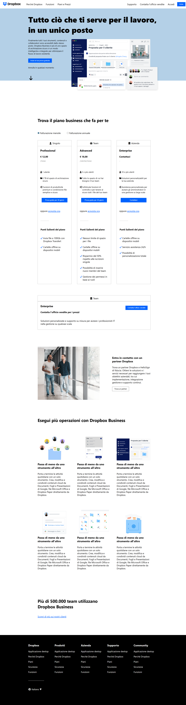

<h1 align="center">Dropbox</h1>

###

  
  
  
  
  

###

###

Descrizione Riproduciamo il layout come da screenshot (che rimane il nostro riferimento principale) cercando di essere il più fedeli possibili. Analizziamo sempre prima il layout e scriviamo dei commenti per individuare le macroaree. Facciamo un passo alla volta e puntiamo alla semplicità.   Consigli: Teniamo sempre un approccio ordinato, solo quando tutto funziona passiamo al dettaglio, sezione per sezione. - Cerchiamo però di bilanciare questo, organizzando il nostro tempo di sviluppo non incartandoci sulla singola feature, ma lasciando per dopo semmai i dettagli più complessi se è il caso. Creiamo delle classi riutilizzabili individuando gli elementi ricorrenti nel layout, capendo quindi come e cosa possiamo centralizzare per rendere il nostro codice il più possibile semplice, pulito e quindi mantenibile. Non lavoriamo ancora sul responsive, quindi la nostra pagina non deve adattarsi a tutti i possibili viewport. Se comunque riusciamo almeno a lavorare già un pò con unità relative, senza però crearci nuove difficoltà, tanto meglio.  Scpecifiche aggiuntive: Il font principale è Open Sans, embeddato da GFonts; le icone le prendiamo da FontAwesome; i vari dettagli "avanzati" li possimoa gestire alla fine; la parte della registrazione del video della lezione dove abbiamo fatto la nostra analisi fa parte e completa le specifiche.

###

